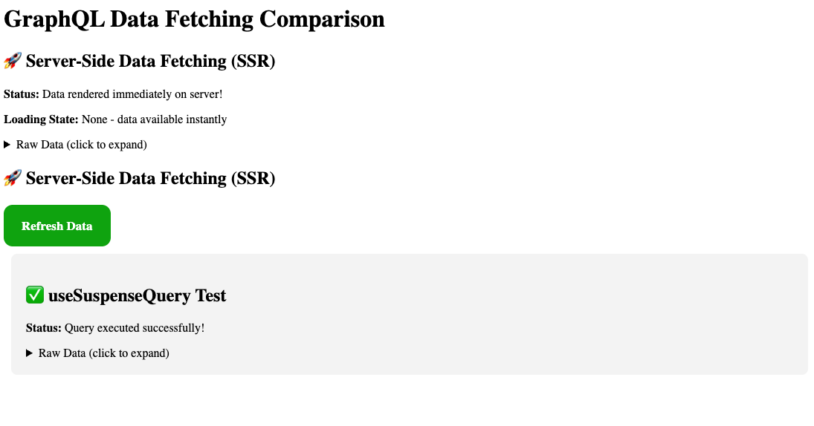

# NextJS + Instacart IDS Template

A ready-to-use NextJS template pre-configured with Instacart's frontend tooling, designed to provide an easy starting point for POCs and 0-1 applications while maintaining development speed and leveraging Instacart's design system.

## 🚀 Why NextJS?

### Full-Stack Framework Benefits

- **Collocated Frontend/Backend**: Single codebase with shared types across the full stack
- **Single Language**: End-to-end TypeScript development
- **File-based Routing**: Intuitive page routing out of the box
- **Rich Ecosystem**: Extensive library support for auth, database integrations, and more

### Development Experience

- **AI/LLM Optimized**: NextJS has the most training data available, making it ideal for Cursor and other AI coding assistants
- **React Server Components (RSC)**: Currently the only framework that fully leverages RSC - a powerful React feature our current web apps can't use
- **Modern React Features**: Built-in support for the latest React innovations

### Scalability

- **0-1 to Scale**: Perfect for rapid prototyping and can scale to 50-100k+ users
- **Backend-for-Frontend (BFF)**: Can evolve into a BFF pattern when connecting to dedicated backends
- **Production Ready**: Battle-tested framework used by companies at scale

## 🚀 Quick Start Guide

### Prerequisites

- Node.js 18+. [Link to download NodeJs](https://nodejs.org/en/download/current)
- Access to Instacart's private npm registry (`@instacart` packages). You will be prompted to set this up if you haven't already when installing dependencies [Link to Doc](https://instacart.atlassian.net/wiki/spaces/Customers/pages/2081816908/Using+GitHub+Package+Registry+GPR+for+Yarn+NPM+PNPM)
- If you want to query the Instacart GraphQL server, ensure the bento customers/fullstack profile is running.

  ```bash
  bento profile set customers/backend
  bento setup # or bento update if setup was already ran
  ```

### Installation

1. **Clone the repository**

   ```bash
   git clone <your-repo-url>
   cd ids-nextjs
   ```

1. **Install dependencies**

   ```bash
   yarn install
   # or
   npm install
   ```

   Note: running npm/yarn install will trigger the `setup_gpr` script through a preinstall hook. This will check if you have set up an access token for Instacart GitHub Package Registry (GPR) in order to download IDS dependencies, and prompt you to paste one if you've never set it up.

1. **Start development server**

   ```bash
   yarn dev
   # or
   npm run dev
   ```

1. **Open your browser**
   Navigate to [http://localhost:3000](http://localhost:3000). If you have the customers/fullstack profile running, you should be able to see the data fetched from the example `BusinessLayout` query.

 <p align="center">
  
</p>

## 🛠️ What's Pre-Configured

### Instacart Design System (IDS)

- **@instacart/ids-core**: Core design system components and theming
- **@instacart/ids-customers**: Customer-facing component library
- **Theme Integration**: Pre-configured with sample theme overrides
- **TypeScript Support**: Full type safety for IDS components

### Apollo Client GraphQL & Data Fetching

- **Apollo Client**: Pre-configured with Next.js integration for RSC support, and codegen commands
- **Server Components**: Query data directly in server components with `getClient()`
- **Client Components**: Full Apollo Client provider setup for client-side data fetching

#### Server Component Usage

```typescript
import { gql } from '@apollo/client';
import { getClient } from '@/lib/apollo-client';

const GET_USERS = gql`
  query GetUsers {
    users {
      id
      name
      email
    }
  }
`;

export default async function UsersPage() {
  const { data, loading, error } = await getClient().query({
    query: GET_USERS,
  });
}
```

#### Client Component Usage

```typescript
'use client';

import { gql, useQuery } from '@apollo/client';

const GET_USERS = gql`
  query GetUsers {
    users {
      id
      name
      email
    }
  }
`;

export default function UsersClient() {
  const { data, loading, error } = useQuery(GET_USERS);
}
```

#### Client Component with Suspense (Recommended for RSC)

```typescript
"use client";

import { Suspense } from "react";
import { gql, useSuspenseQuery } from "@apollo/client";

const GET_USERS = gql`
  query GetUsers {
    users {
      id
      name
      email
    }
  }
`;

export default function UsersClientSuspense() {
  const { data } = useSuspenseQuery(GET_USERS);

  return (
    <div>
      {data.users.map((user) => (
        <div key={user.id}>
          <h3>{user.name}</h3>
          <p>{user.email}</p>
        </div>
      ))}
    </div>
  );
}

// Usage in parent component with Suspense boundary
export function UsersPage() {
  return (
    <Suspense fallback={<div>Loading users...</div>}>
      <UsersClientSuspense />
    </Suspense>
  );
}
```

> **Why useSuspenseQuery is better for RSC**: `useSuspenseQuery` integrates seamlessly with React's Suspense boundaries, enabling better streaming and progressive loading. It eliminates the need for manual loading states and works perfectly with Next.js's streaming SSR, allowing the server to send HTML as soon as it's ready while still loading data in the background.

### GraphQL Code Generation

The template includes GraphQL Code Generator for automatic TypeScript type generation from your GraphQL schema and operations.

#### Prerequisites

- **GraphQL Server**: A GraphQL server must be running locally at `http://localhost:3030/graphql`. This should work with the default bento customers/backend profile
- **GraphQL Operations**: Define your queries, mutations, and subscriptions in `src/**/queries.ts` files

#### Running Code Generation

```bash
# Generate TypeScript types from GraphQL schema and operations
yarn codegen

# This will:
# 1. Clean up existing generated files
# 2. Connect to your local GraphQL server
# 3. Generate types in src/__generated__/graphql-types.ts
```

### Styling & Theming

- **Emotion**: CSS-in-JS with full theme integration
- **CSS Prop Support**: Use `css` prop on any element with theme access
- **Responsive Design**: Media queries and responsive styling ready

### Performance & Developer Experience

- **React Compiler**: Experimental React compiler for automatic optimizations
- **Next.js 15**: Latest version with App Router and React 19 support
- **TypeScript**: Full TypeScript setup with proper type declarations
- **Image Optimization**: Pre-configured for CloudFront

## 🎨 Theme Configuration

The template includes a sample theme in `src/app/providers.tsx`:

```typescript
const themeOverrides = {
  colors: {
    brandPrimaryRegular: '#0AAD0A',
    brandPrimaryDark: '#098A09',
    brandPrimaryExtraDark: '#0C670C',
    brandSecondaryRegular: '#72767E',
    brandSecondaryDark: '#343538',
    brandSecondaryLight: '#F6F7F8',
    brandHighlightRegular: '#2B78C6',
    brandHighlightDark: '#1F5A96',
  },
};
```

### Using Theme Colors

```typescript
import { useTheme } from "@emotion/react";

function MyComponent() {
  const theme = useTheme();

  return (
    <div
      css={{
        backgroundColor: theme.colors.brandPrimaryRegular,
        color: theme.colors.systemGrayscale80,
        padding: "20px",
      }}
    >
      Themed content
    </div>
  );
}
```

### IDS Components

```typescript
import { PrimaryButton } from "@instacart/ids-customers";

// Use components with full theme integration
<PrimaryButton>Click me</PrimaryButton>;
```

### CSS Prop Support

```typescript
// elements accept a 'css' prop
<div css={{ display: 'flex', gap: '10px' }}>
```

### React Compiler

The template includes React Compiler for automatic performance optimizations. Components are automatically memoized when beneficial, so there is no need to use `useMemo()`, `useCallback()` or `React.Memo` for the majority of use cases.
